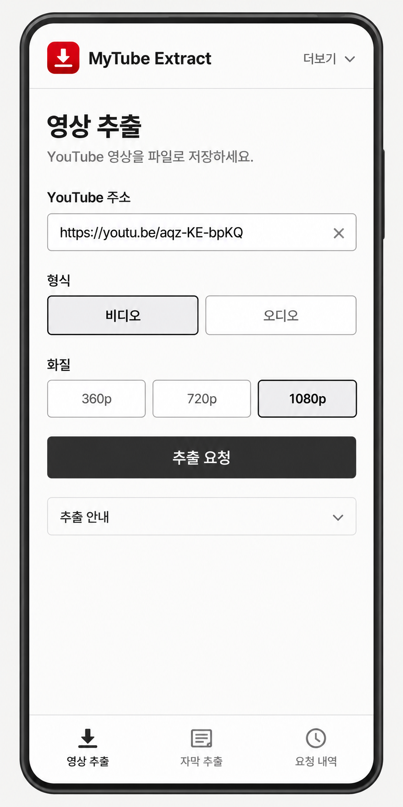
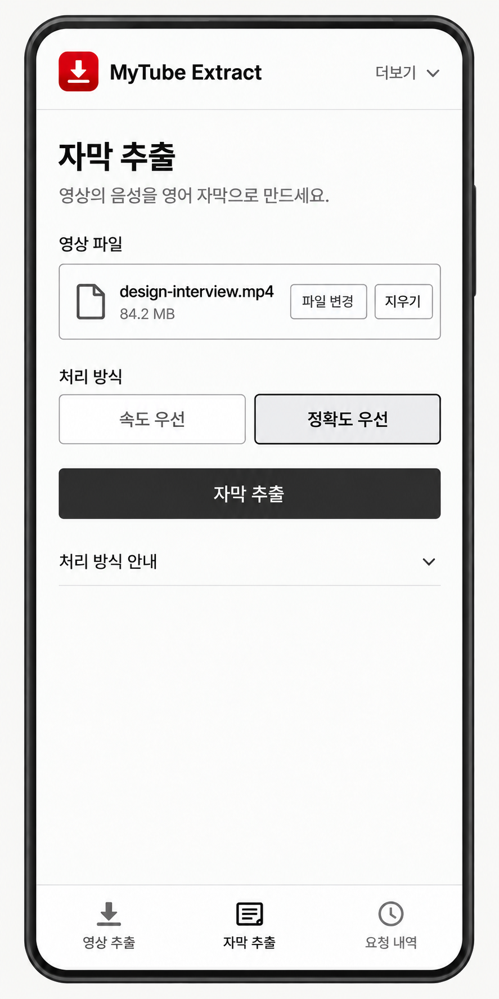
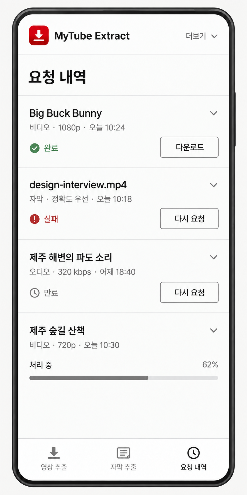
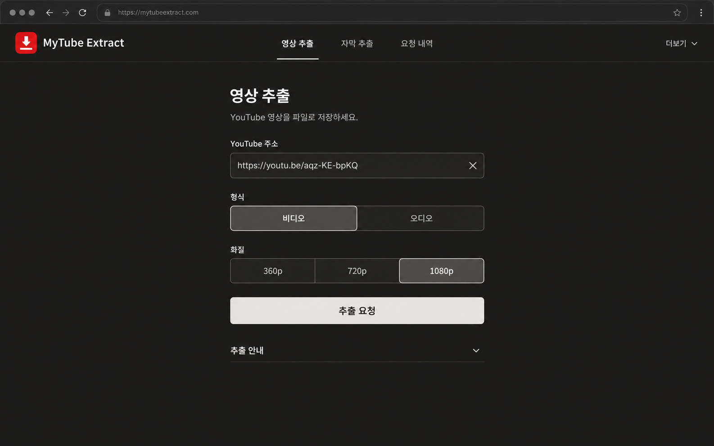

# 최소 구성 재설계 — 1차 시안

[설계 합의](../../decisions.md)를 바탕으로 만든 검토용 이미지 4장이다. 제품 코드는 변경하지 않았다.

## 모바일 · 라이트

영상 입력, 파일 선택 후 자막 입력, 요청 내역을 같은 구성으로 비교한다. 세 화면 모두 하단 고정 탭을 유지한다.

| 영상 추출 | 자막 추출 · 파일 선택 후 | 요청 내역 |
| --- | --- | --- |
|  |  |  |

원본: [영상 추출](mobile-video-light.png) · [자막 추출](mobile-subtitles-light.png) · [요청 내역](mobile-history-light.png)

## 데스크톱 · 다크

상단 메뉴와 하나의 입력 열을 사용한다. 입력 → 형식 → 화질 → 요청의 순서를 모바일과 동일하게 유지한다.

[원본 이미지](desktop-video-dark.png)

## 시안에 반영한 방향

- 로고 아이콘에만 브랜드 빨강을 사용하고, 주요 조작과 선택 표시는 무채색으로 정리한다.
- 입력과 선택지를 바로 보여주고, 기술 설명은 접어둔다.
- 선택된 파일의 정보와 변경·지우기를 한 영역에 모은다.
- 요청 내역은 구분선으로 나누고, 다운로드·다시 요청을 바로 보여준다.
- 완료 항목의 진행 막대는 없애고, 처리 중 항목에만 진행률을 표시한다.
- 재요청은 영상·오디오 즉시 실행, 자막 파일 재선택 후 실행이라는 최신 합의를 따른다. 작성 중인 입력은 유지한다.

## 검토 범위와 생성 기록

- 이번 산출물은 화면의 방향과 구성을 검토하기 위한 정적 시안이다. 새로고침·입력 보존·재요청 등 실제 동작은 구현하지 않았다.
- 이미지 속 영상 제목·파일명·시간·주소·진행률은 화면 구성을 위한 예시다.
- 서체는 Pretendard를 기준으로 지시했으며, 생성 이미지의 글자·색상·간격은 구현용 확정 수치가 아니다.
- 이 이미지로 실제 390×844 화면의 배치, 글자 확대, 접근성 또는 실제 추출 성공을 검증한 것은 아니다.
- 내장 이미지 생성 도구 `image_gen`으로 제작했다. [사용한 생성 입력 원문](PROMPTS.md)을 함께 보관한다.
