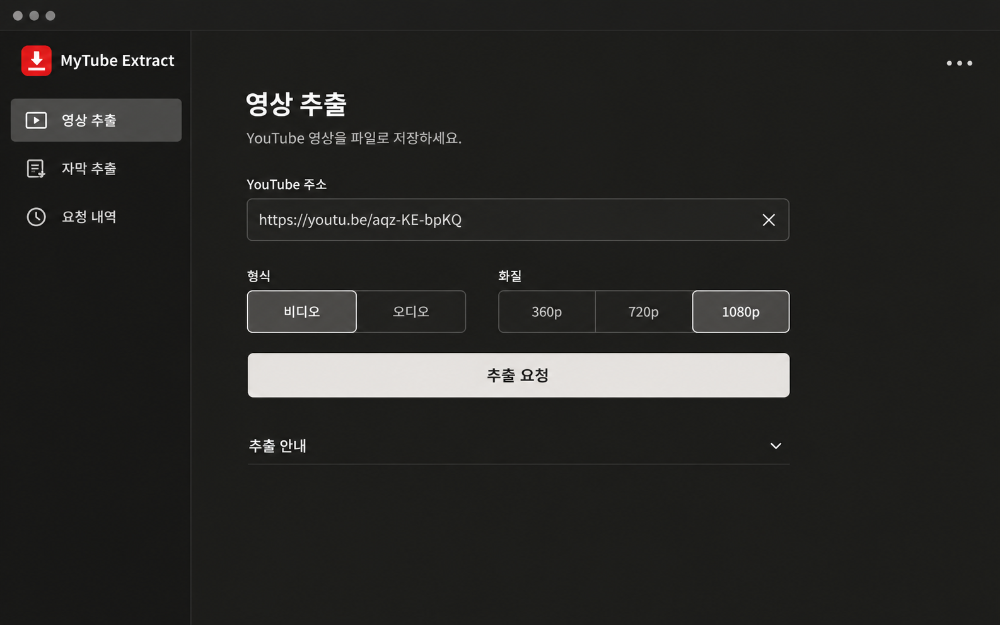
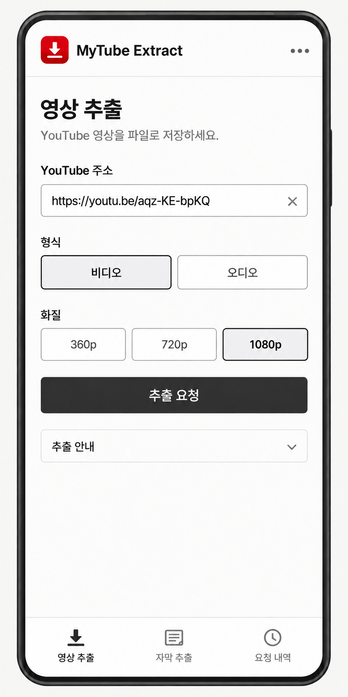
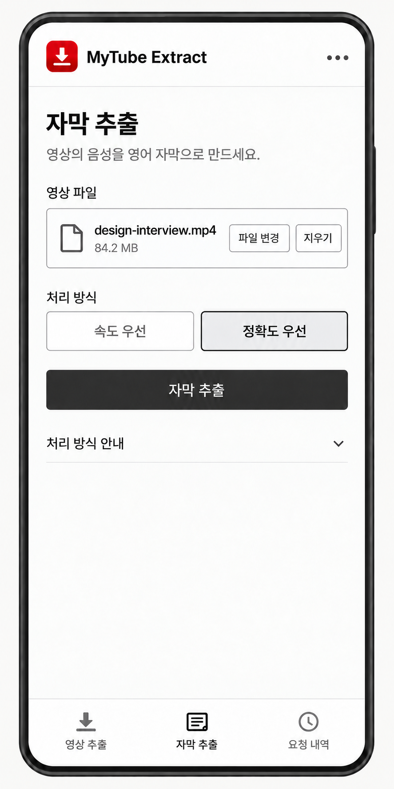
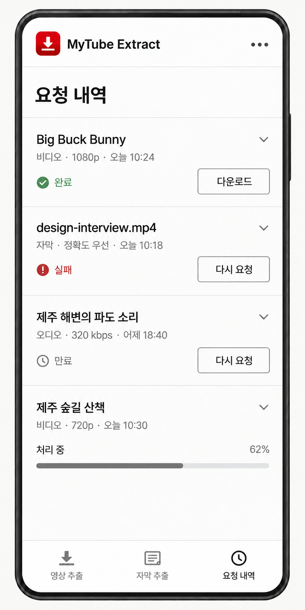

# 최소 구성 재설계 — 2차 시안

[1차 시안](../v1/README.md)에 대한 사용자 피드백을 반영한 이미지 4장이다. 사용자가 `오케이 시안 좋음`으로 이 배치를 승인했다.

이 배치와 최종 행동 계약을 정리한 [구현 명세](../../spec.md)를 `ready-for-agent`로 등록했다.

## 바뀐 점

- 모바일과 데스크톱의 오른쪽 `더보기` 문구·펼침 표시를 가로 점 세 개 `…` 아이콘으로 바꿨다.
- 데스크톱의 상단 탭을 없애고, 왼쪽에 로고와 세 주요 메뉴를 배치했다.
- 오른쪽 작업 영역에 제목과 입력 폼을 정렬했다. 형식·화질 선택은 나란히 두어 세로 길이를 줄였다.
- 모바일은 하단 탭과 기존 입력·내역 구성을 유지했다.

## 승인된 데스크톱 배치 · 다크

[원본 이미지](desktop-video-dark.png) · [이전 배치](../v1/desktop-video-dark.png)

왼쪽 세로 메뉴·오른쪽 작업 영역과 형식·화질의 가로 배치를 채택한다. 헤더의 `…` 아이콘 변경은 사용자가 직접 지정한 수정 사항이다. [최신 설계 합의](../../decisions.md)에 승인 상태를 반영했다.

## 모바일 · 라이트

| 영상 추출 | 자막 추출 | 요청 내역 |
| --- | --- | --- |
|  |  |  |

원본: [영상 추출](mobile-video-light.png) · [자막 추출](mobile-subtitles-light.png) · [요청 내역](mobile-history-light.png)

## 설계 기록

- 아이콘의 시각 표현은 `…`로 바꾸되 버튼의 접근성 이름은 `더보기`로 유지한다. 기존 보조 메뉴 기능을 연결하고 충분한 조작 영역을 확보한다.
- 화면 속 자료는 예시이며, 서체·색상·간격의 정확한 구현 수치나 실제 동작 검증 결과를 뜻하지 않는다.
- 제품 코드는 수정하지 않았다.
- 내장 이미지 생성 도구 `image_gen`으로 기존 시안을 편집했다. [생성 입력 원문](PROMPTS.md)을 함께 보관한다.
